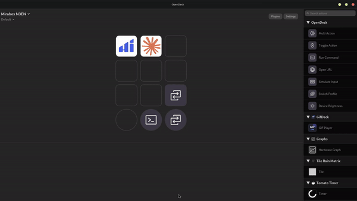

# GifDeck

<p align="center">
  
  
  
  
</p>

<p align="center">
  
</p>


Play **animated GIFs** on your Stream Deck / OpenDeck keys — with an optional command fired on key press.

The Stream Deck SDK's `setImage` doesn't support animated formats. GifDeck works around this the same way Elgato's own animated plugins do: it decodes the GIF into individual frames once, then cycles them onto the key with `setImage` on a timer driven by each frame's real delay. The result is smooth animation on any device OpenDeck supports — including non-Elgato hardware like the Mirabox N3.

## Features

- Animated GIF playback on any keypad key
- Per-frame timing taken from the GIF itself (not a fixed framerate)
- Adjustable speed multiplier (0.25×–4×)
- Optional shell command on key press — turns any animated key into a launcher
- Works on Linux via [OpenDeck](https://github.com/nekename/OpenDeck)

## Requirements

- [OpenDeck](https://github.com/nekename/OpenDeck) (Linux/macOS/Windows) **or** Elgato Stream Deck software 6.0+
- Node.js 20+ and the Elgato CLI (for building from source)

## Install (from source)

```bash
git clone https://github.com/GitFlowLink/gifdeck.git
cd gifdeck
npm install
npm run build
```

Then link the plugin into OpenDeck's plugin directory and restart OpenDeck (see the
[OpenDeck plugin docs](https://github.com/nekename/OpenDeck) for the exact path on your system),
or package a distributable with the Elgato CLI:

```bash
npx streamdeck pack dev.gitflowlink.gifdeck.sdPlugin
```

## Usage

1. Drag the **GIF Player** action onto a key.
2. In the Property Inspector, click **Browse…** to pick a `.gif` file via your
   system file dialog (uses `kdialog` on KDE, falls back to `zenity` on GTK),
   or paste an absolute path directly into the field.
3. (Optional) Enter a command to run when the key is pressed.
4. (Optional) Adjust playback speed.

The key animates immediately. Pick a different GIF at any time and it swaps right away.

## Notes

- The native file picker needs `kdialog` (KDE) or `zenity` (GNOME/GTK) installed.
  Most desktops ship one of them; if neither is present, paste the path manually.
- Paths support `~` expansion (e.g. `~/Pictures/cat.gif`).

## How it works

```
GIF file ──▶ gifuct-js (decode + de-dispose frames)
         ──▶ composite each frame onto a persistent RGBA canvas
         ──▶ scale to 144×144, encode PNG (pngjs)
         ──▶ data-URL frames cached in memory
         ──▶ setImage() on a timer using each frame's delay
```

State is tracked per key context, so multiple animated keys run independently. Timers are cleared
on `onWillDisappear` to avoid leaks when switching profiles or pages.

## Tech

TypeScript · Elgato Stream Deck SDK v1 · gifuct-js · pngjs · Rollup

## License

[MIT](LICENSE) © 2026 Vladimir (GitFlowLink)
